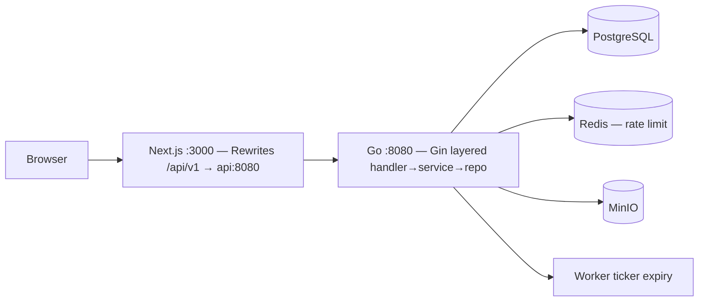

# Kostify — Booking Kost Terverifikasi

Marketplace booking kost tanpa pembayaran online. Penyewa mencari kost terverifikasi, booking kamar yang tersedia dengan tanggal survey, kamar ter-reserve 3 hari. Admin menugaskan teknisi untuk survey kost baru; hasil survey menentukan verifikasi. Pemilik melakukan survey & deal luring, lalu approve booking menjadi kontrak sewa 1–12 bulan. Pembayaran di luar platform. Satu Next.js app: `/` publik untuk penyewa, `/dashboard` CMS untuk pemilik, teknisi & admin.

---

## Daftar Isi
- Problem & Target User
- Fitur
- Tech Stack & Arsitektur
- Desain Database
- Instalasi & Konfigurasi
- Migrasi & Menjalankan Aplikasi
- Testing
- Dokumentasi API
- Keputusan Teknis & Trade-off
- Future Improvement

## Problem
1. Pemilik kelola kamar manual (WA/catatan) → booking tumpang tindih
2. Calon penyewa tidak tahu kamar mana benar-benar kosong
3. Iklan kost palsu → calon rugi DP sebelum survey
4. Tidak ada jejak kesepakatan sewa (durasi, tanggal mulai)

## Target User
| Peran | Kebutuhan |
|-------|-----------|
| **Tenant** (pencari) | Cari kost, booking kamar + tanggal survey, chat dengan pemilik, pantau booking/kontrak |
| **Owner** (pemilik) | Kelola banyak kost & kamar, proses booking, jadwal survey, akhiri kontrak, lihat okupansi |
| **Teknisi** | Terima tugas survey kost dari admin, lihat detail kost, approve/reject hasil survey |
| **Super Admin** | Verifikasi via teknisi atau manual, assign teknisi, kelola user & jadwal survey |

## Fitur
- **Publik**: landing page (hero search, kategori, kost terbaru, CTA), daftar kost filter/sort/pagination, detail kost + daftar kamar + booking (dengan tanggal survey maks. 5 hari ke depan), detail kamar (galeri foto), register (dengan gender)/login — design system Kostara & dwibahasa ID/EN
- **Verifikasi email**: register → link verifikasi (dev: link tampil di response & log API) → login terblokir sampai verify; endpoint resend tersedia
- **Chat 1:1**: tenant↔owner (tombol "Chat Pemilik" di detail kost/kamar), admin→owner dari halaman verifikasi; badge unread di header (polling 20s); halaman `/chat`
- **Tenant**: booking kamar + tanggal survey (1 pending per kamar — partial unique index), batal pending, riwayat booking & kontrak
- **Owner CMS**: analytics (okupansi, pending, revenue), CRUD kost/kamar + upload foto MinIO, inbox booking (approve/reject → kontrak), kelola kontrak, agenda event survey (readonly)
- **Teknisi**: dashboard `/dashboard/teknisi` — daftar tugas survey, lihat detail kost (termasuk yang belum verified), setujui/tolak dengan catatan min. 5 karakter → status kost ikut berubah
- **Super Admin**: verifikasi kost (assign teknisi — aksi manual setujui/tolak disembunyikan, tanda "Sudah diassign"), master semua kost (edit/hapus/toggle aktif), kelola user (buat owner/teknisi dengan gender, nonaktifkan, ubah role), kelola jadwal survey `/dashboard/events`
- **Bonus**: MinIO S3, expiry worker (pending→expired otomatis 72h), Redis rate-limit & cache, Docker Compose, notifikasi in-app (bell + polling), auto-event saat booking/assign

### Business Flow
```
Kost: pending ─survey teknisi (approve)→ verified | ─reject/teknisi tolak→ rejected
Room: available ↔ reserved (booking) → occupied (kontrak) → available
Booking: pending → processing (survey jalan) → approved→contract | rejected | expired (72h) | cancelled (tenant)
Contract: active → ended
Assignment: assigned → surveying → approved/rejected (decided)
User: register → email_verified (login diblokir sebelum verify; user lama otomatis verified)
```

## Tech Stack
| Lapisan | Stack |
|---------|-------|
| Backend | Go 1.26, Gin, GORM, PostgreSQL 16, golang-migrate (embed), JWT (access 15m + refresh 7d rotation), bcrypt, Redis 7, MinIO |
| Frontend | Next.js 16 (App Router), React 19, TypeScript, Tailwind v4, TanStack Query/Table, Axios, Sonner, Recharts, @tailgrids/icons, i18n ID/EN custom (`src/i18n.tsx`) |
| Modul backend | `auth` (+verify email), `users`, `kosts`, `bookings` (+survey_date), `survey` (assignment+events), `chat`, `uploads`, `platform/*` |
| Infra | Docker Compose (api, frontend, db, redis, minio), Makefile |

## Arsitektur



- **Cookie-based auth** (HttpOnly, Secure, SameSite=Lax, Path, Max-Age) + **CSRF double-submit** (`csrf_token` cookie + `X-CSRF-Token` header). Same-origin via Next.js rewrites (`/api/v1` → `API_INTERNAL_URL`) → bebas CORS; axios client pakai baseURL relatif `/api/v1`.
- **Refresh rotation** + reuse detection → revoke-all jika refresh lama dipakai ulang (tanda theft).
- **Layered** `handler→service→repo` per modul (`auth`, `kosts`, `bookings`, `users`, `uploads`, `platform/*`).
- **Migrasi SQL mentah** (`000001_init`) reproducible dari DB kosong, `make migrate-up/down`.

## Design System (Kostara)

Halaman publik memakai design system **Kostara** di `frontend/src/app/css/kostara.css`:

- **Font**: Rubik via `next/font/google` (variable `--font-rubik`), dipakai untuk display & body.
- **Warna**: ink `#251B3D`, paper `#F3F0EA`, amber/brand `#8550E6`, green `#4C8264` — CSS custom properties.
- **Komponen**: `.card`, `.tag`, `.chip`, `.badge-verified`, `.btn-primary/outline/ghost`, `.search-card`, `.step`, `.cta-banner`, grid responsif `.grid-3/.grid-4`, `.detail-grid`.
- **Icon**: `@tailgrids/icons` (SVG React components) — tanpa emoji.
- **Halaman publik**: header sticky + mobile menu, hero gradient dengan search bar, kategori, listing kost, footer simple.

## Desain Database

Lihat `docs/product-foundation.md` untuk ERD lengkap. Inti:

- `users` — role enum `super_admin|owner|tenant|teknisi`, `gender` (`laki-laki`/`perempuan`), `email_verified`, email unique
- `kosts` — `owner_id→users`, `gender` enum, `status` pending/verified/rejected, `is_active`, `photos/facilities text[]`, GIN index
- `rooms` — `kost_id→kosts`, `unique(kost_id, room_number)`, `status` enum, `luas`, GIN
- `bookings` — `room_id→rooms`, `tenant_id→users`, `survey_date` (wajib, 0–5 hari dari hari ini), `status` enum, `expires_at`, **partial unique `room_id WHERE status='pending'`** (anti race), `idx expires_at WHERE pending`
- `contracts` — `booking_id unique→bookings`, `room_id`, `tenant_id`, `start_date/end_date`, `status` active/ended
- `email_verification_tokens` — `user_id`, `token_hash`, `expires_at` (24h)
- `kost_assignments` — `kost_id→kosts`, `teknisi_id→users`, `assigned_by→users`, `status` assigned/surveying/approved/rejected, `note`, `decided_at`
- `conversations` — pasangan 1:1 (`user_a_id` < `user_b_id`, unique pair), `messages` — `conversation_id`, `sender_id`, `body`, `read_at`
- `events` — agenda survey: `title`, `kost_id`, `teknisi_id`, `scheduled_at`, dibuat otomatis saat booking/assign, admin bisa manual
- `sessions` — `refresh_token_hash unique`, `expires_at`, `revoked_at`
- `notifications` — `user_id→users`, `title/body/link`, `is_read`, index `(user_id, is_read, created_at DESC)`

`text[]` disimpan sebagai `pq.StringArray` (GORM) agar `{"wifi","ac"}` valid Postgres; jika butuh metadata fasilitas dinamis, pecah jadi pivot.

## Instalasi

```bash
git clone <repo> && cd kostify-v2
cp .env.example .env
cp backend/.env.example backend/.env   # opsional, compose pakai .env root
cp frontend/.env.example frontend/.env
```

Prasyarat: Docker & Docker Compose. Go 1.26 & Node 22 hanya jika ingin jalan tanpa Docker.

## Konfigurasi Env

Root `.env` (dipakai compose):
```
POSTGRES_USER=kostify
POSTGRES_PASSWORD=kostify
POSTGRES_DB=kostify
MINIO_ACCESS_KEY=minioadmin
MINIO_SECRET_KEY=minioadmin
JWT_ACCESS_SECRET=change-me-32chars
JWT_REFRESH_SECRET=change-me-32chars
ADMIN_EMAIL=admin@kostify.local
ADMIN_PASSWORD=Admin123!
```

Backend `.env` menambah `BOOKING_EXPIRY_HOURS=72`, `REDIS_ADDR`, `MINIO_ENDPOINT`, `FRONTEND_URL`.

Frontend `.env` hanya `NEXT_PUBLIC_*` jika perlu; proxy rewrites pakai `API_INTERNAL_URL=http://api:8080` (compose).

## Migrasi

```bash
make migrate-up      # docker compose exec api /app/migrate up
make migrate-down    # down 1 step
make migrate-version # cek versi
```
Migrasi embed di binary (`backend/migrations/*.sql` + `migrations.go`), dijalankan dari DB kosong secara reproducible.

Seed super admin otomatis saat api start (`ADMIN_EMAIL`).

## Data Dummy & Akun Test

Seed data demo (10 kost Malang Raya + kamar) tersedia di `db/seed_malang.sql`:

```bash
docker cp db/seed_malang.sql kostify-v2-db-1:/tmp/ && docker exec kostify-v2-db-1 psql -U kostify -d kostify -f /tmp/seed_malang.sql
```

| Role | Email | Password |
|------|-------|----------|
| Super Admin | `admin@kostify.local` | `Admin123!` |
| Owner (dummy) | `ahmad.fauzi@kostify.test` dll (5 akun, lihat `db/seed_malang.sql`) | `Owner123!` |
| Teknisi (dummy) | `teknisi@kostify.test` | `Teknisi123!` |
| Tenant | daftar sendiri via `/register` (verifikasi email wajib) | — |

Catatan dev: link verifikasi email ditampilkan di response register/resend dan log API (belum ada SMTP).

## Menjalankan Aplikasi

```bash
docker compose up -d --build   # atau make up
docker compose logs -f api frontend
# Frontend: http://localhost:3000  (publik + /dashboard)
# API:      http://localhost:8080/healthz  (via proxy juga di /api/v1/*)
# MinIO:    http://localhost:9001 (console)
make migrate-up
```

Tanpa Docker (dev):
```bash
# terminal 1: backend
cd backend && go run ./cmd/api
# terminal 2: frontend
cd frontend && npm install && npm run dev
```

## Testing

```bash
# Backend unit (DTO & worker logic, tanpa DB)
cd backend && go test ./...

# E2E manual (butuh compose up)
python backend/test_m2.py  # kost & room + upload
python backend/test_m3.py  # booking race, approve→contract, expiry, stats
# atau via curl/postman lihat docs/postman_collection.json

# Frontend
cd frontend && npm run build  # type-check + build
# component test (vitest) — lihat frontend/src/components/ui/button.test.tsx
```

## Dokumentasi API

- **Postman**: `docs/postman_collection.json` — import ke Postman/Insomnia, set `baseUrl=http://localhost:3000/api/v1`, flow login otomatis set cookie, kirim `X-CSRF-Token` dari `csrf_token` cookie untuk POST/PATCH/DELETE.
- **OpenAPI**: `docs/product-foundation.md` §3 API Contract (tabel lengkap) + envelope konsisten `{success,data,message}` / `{success,error:{code,message,details}}`.
- **Swagger**: `go run ./cmd/api` expose `/healthz`; swagger UI bisa di-serve dari `docs/openapi.yaml` via https://editor.swagger.io (opsional `swag init` jika ingin `http-swagger`).

Status code: 200/201/204/400/401/403/404/409/422/429/500 — terpusat di `internal/http/response`.

Interceptor Axios: 401→single-flight refresh, 403, 422 (tampilkan `details` per field), 429, 500. Hindari infinite retry, duplicate refresh, race condition, refresh gagal → logout.

## Keputusan Teknis & Trade-off

| Keputusan | Alasan | Konsekuensi |
|-----------|--------|-------------|
| Cookie HttpOnly + SameSite=Lax + proxy rewrites | Imun XSS steal, bebas CORS, first-party | Perlu CSRF double-submit |
| Partial unique index `room_id WHERE pending` | Race 2 tenant booking kamar sama diselesaikan di DB (bukan `if`) | — |
| Expiry worker in-process ticker + CTE atomic | Nol infra tambahan, idempotent, cukup 1 instance | Multi-instance perlu Redis queue (asynq) — upgrade path jelas |
| `text[]` via `pq.StringArray` | Query `? = ANY(facilities)` + GIN index | Jika butuh metadata, pecah pivot |
| Satu Next.js app `(public)` + `/dashboard` | Satu origin → cookie first-party, satu build, analogi `wp-admin` | Deps template (`fullcalendar` dll) ikut di publik (tree-shake per route) |
| MinIO (S3 API) | Bonus storage, kompatibel S3 produksi | Self-host perlu volume |
| `TranslateError` GORM | `ErrDuplicatedKey` presisi untuk 409 | — |

## Future Improvement
- Per-account rate limit + sliding window, Redis blacklist access token untuk instant revoke
- Pivot tabel fasilitas + GIN trigram untuk search alamat
- Notifikasi email/wa saat booking masuk (queue worker + asynq)
- Audit trail siapa ubah status kamar/kontrak
- E2E Playwright untuk critical flow login→booking→approve→verify

---

## Deliverables Checklist (assignment)
- [x] Backend Go+Gin+GORM+Postgres, layered, `/api/v1`, envelope, centralized error
- [x] Frontend Next.js+Tailwind+Axios (interceptor 401/403/422/429/500), RBAC, search/filter/sort/pagination, reusable components, loading/empty/error/toast/confirm/responsive
- [x] Cookie HttpOnly/Secure/SameSite/Path/Max-Age + CSRF, RBAC backend, migration up/down reproducible, business flow 3-state, validasi penuh
- [x] MinIO, worker expiry, Docker Compose, `.env.example`, README, Postman collection
- [x] Git history (commit Meilensteine)

Lihat `docs/product-foundation.md` untuk fondasi produk & keputusan lengkap.
