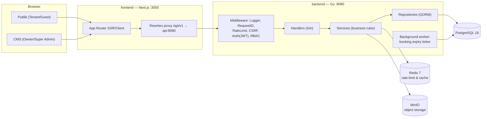

# Kostify — Product Foundation

Platform booking kost tanpa pembayaran online: penyewa mencari & meng-booking kamar, pemilik memverifikasi kecocokan lewat survey offline, transaksi diselesaikan langsung di lokasi.

---

## 1. Business Requirements

### 1.1 Masalah

| # | Masalah | Dampak |
|---|---------|--------|
| 1 | Pemilik kost kelola kamar/penyewa manual (WhatsApp, buku catatan) | Booking tumpang tindih, data hilang, tidak scalable |
| 2 | Calon penyewa sulit tahu kamar mana benar-benar kosong | Waktu terbuang survey ke kost yang penuh |
| 3 | Iklan kost palsu / penipuan (kost tidak ada, foto palsu) | Calon penyewa rugi transfer DP sebelum survey |
| 4 | Tidak ada jejak kesepakatan sewa (durasi, mulai kapan) | Sengketa pemilik–penyewa |

### 1.2 Solusi

Marketplace booking-first **tanpa payment gateway**:

- Penyewa booking kamar yang tersedia → status `pending`, kamar ter-reserve.
- Booking kedaluwarsa otomatis 3 hari jika pemilik tidak menindaklanjuti.
- Pemilik bertemu calon penyewa untuk survey & deal secara luring; baru setujui (`approved`) → kontrak aktif.
- Pembayaran dilakukan langsung di luar platform — platform hanya mencatat kesepakatan.
- Kost baru wajib diverifikasi sebelum tayang (anti-penipuan): super admin menugaskan **teknisi** untuk survey; hasil survey teknisi (approve/reject + catatan) menentukan status kost.
- Registrasi wajib **verifikasi email** sebelum bisa login (link dikirim via email; di mode dev link tampil di response & log API).
- Booking menyertakan **tanggal survey** (maks. 5 hari ke depan) yang otomatis menjadi agenda event pemilik.

### 1.3 Target Pengguna

| Peran | Kebutuhan |
|-------|-----------|
| **Tenant** (calon penghuni) | Cari kost sesuai kriteria, booking kamar, pantau status booking/kontrak sendiri |
| **Owner** (pemilik kost) | Kelola banyak properti & kamar, proses booking, akhiri/perpanjang sewa, lihat statistik okupansi |
| **Teknisi** | Survey kost yang ditugaskan admin, approve/reject hasil survey |
| **Super Admin** | Verifikasi kost (via teknisi atau manual), kelola user & jadwal survey, jaga kredibilitas platform |

### 1.4 Business Rules

1. Kost hanya tampil & bisa di-booking setelah `verified` oleh super admin.
2. Owner hanya dapat mengubah informasi kost & kamar miliknya — membuat/menghapus kost tetap melewati verifikasi ulang.
3. Booking selalu per **kamar spesifik**, bukan per kost.
4. Satu kamar maksimal memiliki **satu booking `pending`** — ditegakkan oleh partial unique index di database (bukan hanya di kode).
5. Booking `pending` kedaluwarsa otomatis setelah **3 hari** (configurable via env `BOOKING_EXPIRY_HOURS`) → kamar kembali `available`.
6. Durasi kontrak sewa **1–12 bulan**; perpanjangan = kontrak baru.
7. Owner dapat mengakhiri kontrak lebih awal (tenant keluar/di-kick) → kamar kembali `available`.
8. Aturan gender kost: `putra` / `putri` / `campur` — ditampilkan saat pencarian.

### 1.5 State Machine

```
Kost:     pending ──verify──▶ verified
             └────reject────▶ rejected

Room:     available ◀──▶ reserved        (booking dibuat / batal-expired)
          reserved ──approve──▶ occupied (kontrak aktif)
          available ◀──▶ maintenance     (owner set, hanya dari available)

Booking:  pending -> processing (owner tandai survey berjalan)
          pending/processing -> approved   (owner setuju setelah survey)
          pending/processing -> rejected   (owner tolak + alasan)
          pending/processing -> expired    (lewat 72 jam, job otomatis)
          pending -> cancelled  (dibatalkan tenant sendiri)
Contract: active ──▶ ended       (masa habis otomatis / owner akhiri)
```

### 1.6 RBAC

| Aksi | Tenant | Owner | Super Admin |
|------|:------:|:-----:|:-----------:|
| Browse kost verified | ✅ | ✅ | ✅ |
| Register / login / kelola profil sendiri | ✅ | ✅ | ✅ |
| Buat / batalkan booking sendiri | ✅ | ❌ | ❌ |
| Kelola kost & kamar milik sendiri | ❌ | ✅ | ❌ |
| Approve / reject booking pada kostnya | ❌ | ✅ | ❌ |
| Akhiri kontrak pada kostnya | ❌ | ✅ | ❌ |
| Verifikasi / tolak kost | ❌ | ❌ | ✅ |
| Kelola user (nonaktifkan, ubah role) | ❌ | ❌ | ✅ |

Role tambahan **Teknisi**: melihat tugas survey (`/teknisi/assignments`), melihat detail kost termasuk yang belum verified, dan memutuskan hasil survey (approve/reject + catatan) — tidak bisa mengelola kost/user.

Authorization **selalu dievaluasi di backend** per request (middleware role + cek kepemilikan resource). Frontend hanya menyembunyikan menu/elemen.

---

## 2. Database / ERD

PostgreSQL 16 + GORM. Semua tabel pakai `UUID` primary key (`gen_random_uuid()`).

```mermaid
erDiagram
    USERS ||--o{ SESSIONS : "login"
    USERS ||--o{ KOSTS : owns
    USERS ||--o{ BOOKINGS : makes
    USERS ||--o{ CONTRACTS : holds
    KOSTS ||--o{ ROOMS : has
    ROOMS ||--o{ BOOKINGS : receives
    ROOMS ||--o{ CONTRACTS : covers
    BOOKINGS ||--|| CONTRACTS : creates
    USERS ||--o{ EMAIL_VERIFICATION_TOKENS : verifies
    KOSTS ||--o{ KOST_ASSIGNMENTS : surveyed_via
    USERS ||--o{ KOST_ASSIGNMENTS : assigned_teknisi
    USERS ||--o{ CONVERSATIONS : chats
    CONVERSATIONS ||--o{ MESSAGES : contains
    KOSTS ||--o{ EVENTS : scheduled

    users {
        uuid id PK
        varchar name
        varchar email UK
        varchar phone
        varchar password_hash
        user_role role "super_admin|owner|tenant|teknisi"
        varchar gender "laki-laki|perempuan"
        boolean is_active
        boolean email_verified
        timestamptz created_at
        timestamptz updated_at
    }
    sessions {
        uuid id PK
        uuid user_id FK
        varchar refresh_token_hash
        timestamptz expires_at
        timestamptz revoked_at "nullable"
    }
    kosts {
        uuid id PK
        uuid owner_id FK
        varchar name
        text description
        varchar address
        varchar city
        kost_gender gender "putra|putri|campur"
        kost_status status "pending|verified|rejected"
        text rejection_note
        text_array photos
        text_array facilities
        timestamptz verified_at
    }
    rooms {
        uuid id PK
        uuid kost_id FK
        varchar room_number "UNIQUE(kost_id, room_number)"
        numeric price_monthly
        room_status status "available|reserved|occupied|maintenance"
        text_array photos
        text_array facilities
    }
    bookings {
        uuid id PK
        uuid room_id FK
        uuid tenant_id FK
        booking_status status "pending|processing|approved|rejected|expired|cancelled"
        text reject_reason
        date survey_date "0-5 hari dari hari ini"
        timestamptz expires_at
        uuid decided_by FK "nullable"
        timestamptz decided_at "nullable"
    }
    email_verification_tokens {
        uuid id PK
        uuid user_id FK
        varchar token_hash
        timestamptz expires_at "24 jam"
        timestamptz used_at "nullable"
    }
    kost_assignments {
        uuid id PK
        uuid kost_id FK
        uuid teknisi_id FK
        uuid assigned_by FK
        assignment_status status "assigned|surveying|approved|rejected"
        text note "catatan hasil survey, min 5 karakter"
        timestamptz decided_at "nullable"
    }
    conversations {
        uuid id PK
        uuid user_a_id FK "sorted pair, UNIQUE(user_a_id,user_b_id)"
        uuid user_b_id FK
        timestamptz last_message_at
    }
    messages {
        uuid id PK
        uuid conversation_id FK
        uuid sender_id FK
        text body
        timestamptz read_at "nullable"
    }
    events {
        uuid id PK
        uuid created_by FK
        uuid kost_id FK "nullable"
        uuid teknisi_id FK "nullable"
        varchar title
        timestamptz scheduled_at
        text notes
    }
    contracts {
        uuid id PK
        uuid booking_id FK UK
        uuid room_id FK
        uuid tenant_id FK
        date start_date
        date end_date
        contract_status status "active|ended"
        uuid ended_by FK "nullable"
        timestamptz ended_at "nullable"
    }
```

**Constraint & index penting:**

| Index / Constraint | Tujuan |
|---|---|
| `users.email` UNIQUE | Identitas login tunggal |
| `rooms(kost_id, room_number)` UNIQUE | Nomor kamar tak duplikat dalam satu kost |
| `bookings(room_id) WHERE status='pending'` UNIQUE parsial | ★ Anti race condition: dua tenant tak mungkin sama-sama pending di satu kamar — ditolak DB |
| `idx_bookings_expiry ON bookings(expires_at) WHERE status='pending'` | Scan cepat untuk job expiry |
| `idx_rooms_status_price ON rooms(status, price_monthly)` | Filter listing |
| `idx_kosts_city_status ON kosts(city, status)` | Search publik |

**Trade-off tersadari:** `photos` & `facilitas` disimpan sebagai `text[]` (bukan tabel relasi). Query filter fasilitas tetap efisien via GIN index + array containment. Jika nanti butuh metadata per-fasilitas, pecah menjadi tabel pivot.

---

## 3. API Contract

Basis: `/api/v1`. Semua response memakai envelope konsisten:

```jsonc
// Success
{ "success": true,  "data": { }, "message": "..." }
// Error
{ "success": false, "error": { "code": "VALIDATION_ERROR", "message": "...", "details": [...] } }
```

Konvensi query listing: `?page=1&limit=20&search=&sort=created_at&order=desc&status=` — limit max 100, default 20.

### 3.1 Auth

| Method | Endpoint | Akses | Deskripsi | Sukses |
|--------|----------|-------|-----------|--------|
| POST | `/auth/register` | publik | Daftar (`role`: `tenant` \| `owner`) | 201 |
| POST | `/auth/login` | publik | Login → set cookie session + CSRF token | 200 |
| POST | `/auth/logout` | auth | Hapus session, clear cookie | 200 |
| POST | `/auth/refresh` | auth(refresh cookie) | Rotasi access + refresh token | 200 |
| GET | `/auth/me` | auth | Profil user saat ini | 200 |
| GET | `/auth/csrf` | publik | Ambil CSRF token (double-submit) | 200 |
| POST | `/auth/verify-email` | publik | Verifikasi email `{token}` | 200 |
| POST | `/auth/resend-verification` | publik | Kirim ulang link verifikasi `{email}`; login terblokir `EMAIL_NOT_VERIFIED` sampai verify | 200 |

### 3.2 Publik (tanpa login)

| Method | Endpoint | Deskripsi | Sukses |
|--------|----------|-----------|--------|
| GET | `/kosts` | Listing kost **verified**: search, filter `city,gender,facilities,min_price,max_price`, sort, pagination | 200 |
| GET | `/kosts/:id` | Detail kost verified + daftar kamar + jumlah tersedia | 200 |

### 3.3 Tenant

| Method | Endpoint | Deskripsi | Sukses |
|--------|----------|-----------|--------|
| POST | `/bookings` | Booking `{room_id}` → 409 jika sudah ada pending | 201 |
| GET | `/bookings/me` | Riwayat booking milik sendiri | 200 |
| PATCH | `/bookings/:id/cancel` | Batalkan booking milik sendiri (hanya saat pending) | 200 |

### 3.4 Owner

| Method | Endpoint | Deskripsi | Sukses |
|--------|----------|-----------|--------|
| GET | `/owner/stats` | Okupansi, booking per status, revenue potensial | 200 |
| GET | `/owner/kosts` | Semua kost milik sendiri (semua status) | 200 |
| POST | `/owner/kosts` | Ajukan kost baru → status `pending` | 201 |
| PATCH | `/owner/kosts/:id` | Edit info kost milik sendiri | 200 |
| GET | `/owner/kosts/:id/rooms` | Daftar kamar | 200 |
| POST | `/owner/kosts/:id/rooms` | Tambah kamar | 201 |
| PATCH | `/owner/rooms/:id` | Edit kamar (harga, fasilitas, status maintenance) | 200 |
| DELETE | `/owner/rooms/:id` | Hapus kamar (hanya jika available & tanpa kontrak aktif) | 204 |
| GET | `/owner/bookings` | Inbox booking kost milik sendiri, filter status | 200 |
| PATCH | `/owner/bookings/:id/approve` | Setuju + `{start_date, duration_months}` → buat kontrak | 200 |
| PATCH | `/owner/bookings/:id/reject` | Tolak + `{reason}` | 200 |
| GET | `/owner/contracts` | Kontrak pada kost milik sendiri | 200 |
| PATCH | `/owner/contracts/:id/end` | Akhiri kontrak lebih awal | 200 |

Semua endpoint owner memvalidasi **kepemilikan resource** (bukan cuma role).

### 3.5 Super Admin

| Method | Endpoint | Deskripsi | Sukses |
|--------|----------|-----------|--------|
| GET | `/admin/kosts` | Semua kost, filter `status=pending` untuk antrian verifikasi | 200 |
| PATCH | `/admin/kosts/:id/verify` | Verifikasi kost | 200 |
| PATCH | `/admin/kosts/:id/reject` | Tolak + `{note}` | 200 |
| GET | `/admin/users` | Semua user, search & filter role | 200 |
| PATCH | `/admin/users/:id` | Ubah `is_active` / `role` / `email_verified` | 200 |
| POST | `/admin/users` | Buat user (owner/teknisi) — otomatis verified | 201 |
| POST | `/admin/kosts/:id/assign` | Assign teknisi survey `{teknisi_id, scheduled_at?}` → assignment + event | 200 |
| GET | `/admin/assignments` | Semua assignment survey | 200 |
| POST | `/admin/events` | Buat jadwal survey manual | 201 |
| DELETE | `/admin/events/:id` | Hapus jadwal survey | 204 |

### 3.6 Teknisi & Chat & Events

| Method | Endpoint | Akses | Deskripsi |
|--------|----------|-------|-----------|
| GET | `/teknisi/assignments` | teknisi | Tugas survey milik sendiri |
| PATCH | `/teknisi/assignments/:id/decide` | teknisi | Putuskan `{decision: approved\|rejected, note}` (note min. 5 karakter) → status kost ikut berubah |
| GET | `/events` | auth | Agenda survey (admin: semua; owner/teknisi: miliknya) |
| POST | `/chat/start` | auth | Mulai/ambil percakapan 1:1 `{with_user_id}` |
| GET | `/chat/conversations` | auth | Daftar percakapan + pesan terakhir + unread |
| GET | `/chat/unread` | auth | Total unread (badge header, polling 20s) |
| GET/POST | `/chat/conversations/:id/messages` | auth | Baca / kirim pesan |

### 3.7 Lain-lain

| Method | Endpoint | Deskripsi |
|--------|----------|-----------|
| POST | `/uploads/images` | Upload foto (auth owner/admin). Validasi MIME whitelist (jpeg/png/webp), max 2 MB, nama file UUID. Return URL MinIO |
| GET | `/healthz` | Liveness + cek DB |

**Status code:** `200` OK · `201` Created · `204` No Content · `400` Bad Request · `401` Unauthorized · `403` Forbidden · `404` Not Found · `409` Conflict (booking bentrok, email duplikat) · `422` Validation Error · `429` Rate Limited · `500` Internal.

Detail request/response lengkap didokumentasikan via Swagger (OpenAPI), disajikan di `/swagger/index.html`.

---

## 4. Frontend IA (Information Architecture)

Satu aplikasi Next.js App Router — analogi WordPress: `/` situs publik, `/dashboard` panel admin.

### 4.1 Publik `(public)` — route group tanpa sidebar

```
/                        Landing: hero + search bar + kost unggulan
/kosts                   Listing: search, filter (kota, harga, gender, fasilitas), sort, pagination
/kosts/[id]              Detail: galeri, deskripsi, daftar kamar + badge status, tombol Booking
/login                   Login
/register                Registrasi (gender, notice verifikasi email)
/verify-email            Verifikasi email via token
/chat                    Chat 1:1 (badge unread di header)
/my-bookings             (auth) Booking saya + status badge + countdown expiry + cancel
/profile                 (auth) Data profil, ganti foto
```

### 4.2 CMS `dashboard` — shell sidebar dari template (owner & super admin)

```
/dashboard               Overview: kartu statistik + grafik (recharts)
/dashboard/kosts         Daftar kost saya (+ status verifikasi)
/dashboard/kosts/new     Form ajukan kost (→ pending verifikasi)
/dashboard/kosts/[id]    Detail & edit kost + kelola kamar
/dashboard/bookings      Inbox booking: tab Pending/Processing/Riwayat; aksi Proses (survey jalan), Approve (modal tanggal+durasi), Reject (modal alasan)
/dashboard/contracts     Kontrak aktif; aksi akhiri sewa (confirm dialog)
/dashboard/verification  [super admin] Antrian verifikasi: assign teknisi (+tanda "Sudah diassign"), chat pemilik
/dashboard/teknisi       [teknisi] Tugas survey: lihat kost, setujui/tolak + catatan
/dashboard/events        [admin] Kelola jadwal survey; owner/teknisi readonly
/dashboard/users         [super admin] Kelola user (buat owner/teknisi, role, gender, verifikasi manual)
```

Proteksi route: middleware Next.js membaca session cookie untuk redirect awal (UX), backend tetap sumber kebenaran otorisasi.

State global minimal: auth context (user saat ini via `/auth/me`). Data server memakai TanStack Query.

---

## 5. System Architecture



### 5.1 Keputusan teknis utama

| Keputusan | Alasan | Trade-off |
|-----------|--------|-----------|
| **Cookie-based session (JWT access 15m + refresh opaque 7d)** | HttpOnly = imun XSS steal token; stateful session table = revoke instan | Perlu penanganan CSRF |
| **CSRF: double-submit cookie + header `X-CSRF-Token`** | Stateless, sederhana, cukup karena frontend same-origin via rewrites proxy (cookie first-party, `SameSite=Lax`) | Butuh disiplin klien menyertakan header |
| **Refresh rotation + reuse detection** | Refresh token lama dipakai ulang → semua session user di-revoke (tanda theft) | Simpan hash token di DB |
| **Partial unique index untuk booking** | Race condition dua tenant book kamar sama diselesaikan **di level DB**, bukan `if` aplikasi | — |
| **Expiry job = goroutine ticker scan DB (in-process)** | Nol infra tambahan, idempotent, cukup untuk skala ini | Single instance only; swap ke Redis queue/asynq saat multi-instance |
| **Next.js rewrites proxy `/api/v1`** | Same-origin → bebas CORS, cookie first-party, `Secure` cookie tetap bisa di dev via compose network | Proxy hop kecil |
| **MinIO (S3-compatible)** | Bonus requirement; API sama dengan S3 produksi | Self-host perlu volume |
| **Layered architecture Go** (`handler → service → repo`) | Jelas, mudah dites, umum dipakai industri | Lebih banyak file dibanding flat |
| **Migrasi SQL mentah via golang-migrate (embed)** | Reproducible dari DB kosong, up/down eksplisit, kontrol penuhi DDL/index | Tak dapat auto-migrate ala GORM |

### 5.2 Keamanan

- Cookie: `HttpOnly`, `Secure` (di belakang TLS/compose internal), `SameSite=Lax`, `Path=/`, `Max-Age`.
- Password: bcrypt cost 12.
- Rate limit: login/register 5 req/menit per IP (Redis), endpoint umum 100 req/menit.
- Security headers: `X-Content-Type-Options`, `X-Frame-Options`, CSP dasar (via middleware Gin).
- Upload: whitelist MIME sniffing (bukan sekadar extension), max size, filename UUID acak, akses publik read-only bucket.
- Error terpusat: handler tidak pernah bocorkan error DB/stack trace; log internal berisi request ID.

---

## 6. Repository Structure

```
kostify-v2/
├── backend/
│   ├── cmd/
│   │   ├── api/main.go            # entrypoint HTTP + worker ticker
│   │   └── migrate/main.go        # CLI migrasi (embed SQL): up/down/version
│   ├── internal/
│   │   ├── config/                # load .env, struct config
│   │   ├── database/              # koneksi GORM + health check
│   │   ├── http/
│   │   │   ├── middleware/        # logger, recover, request-id, rate-limit, csrf, auth, rbac
│   │   │   ├── router.go
│   │   │   └── response/          # envelope sukses/error terpusat
│   │   ├── modules/
│   │   │   ├── auth/              # handler, service, repository, dto
│   │   │   ├── users/
│   │   │   ├── kosts/             # kost + rooms
│   │   │   ├── bookings/          # booking + expiry worker logic
│   │   │   └── contracts/
│   │   └── platform/
│   │       ├── redis/
│   │       └── minio/
│   ├── migrations/                # 000001_init.up/down.sql
│   ├── Makefile
│   ├── Dockerfile
│   └── .env.example
├── frontend/
│   ├── src/
│   │   ├── app/
│   │   │   ├── (public)/          # situs tenant/guest
│   │   │   ├── dashboard/         # CMS owner/super admin (shell template)
│   │   │   └── layout.tsx
│   │   ├── components/            # reusable UI (template tailgrids + custom)
│   │   ├── services/api/          # axios instance + interceptor 401/403/422/429/500
│   │   ├── hooks/
│   │   ├── types/
│   │   └── utils/
│   ├── Dockerfile
│   └── .env.example
├── docs/
│   └── product-foundation.md      # dokumen ini
├── docker-compose.yml             # db, redis, minio, api, frontend
├── Makefile                       # make up / migrate-up / migrate-down / logs
├── .env.example
└── README.md
```

Backend modular monolith: tiap modul punya `handler/service/repository/dto` sendiri, komunikasi lintas modul lewat service interface. Frontend satu app dengan dua zona route group.

---

## 7. Implementation Milestones

Setiap milestone = kondisi "bisa didemokan".

| # | Milestone | Isi | Selesai ketika |
|---|-----------|-----|----------------|
| M0 | Fondasi | Repo scaffold, Docker Compose (postgres, redis, minio, api, frontend), migrasi baseline, `/healthz`, Makefile | `docker compose up` → semua service hidup, `make migrate-up` jalan dari DB kosong, healthz hijau |
| M1 | Auth & RBAC | Register/login/logout/refresh/me, bcrypt, JWT + rotasi refresh, CSRF double-submit, middleware auth+role, seed super admin, rate limit login | Login dari REST client → cookie ter-set; akses endpoint owner dengan role tenant → 403 |
| M2 | Kost & Rooms | CRUD kost+kamar (owner), upload MinIO, verifikasi (super admin), listing publik search/filter/sort/pagination | Owner ajukan kost → super admin verifikasi → kost muncul di listing publik dengan filter jalan |
| M3 | Booking Engine | Create booking (race-safe), cancel, approve→kontrak, reject, expiry worker, end contract, stats owner | Dua booking serentak kamar sama → satu 409; booking tanpa kabar 3 hari → expired otomatis; approve → kamar occupied + kontrak aktif |
| M4 | Frontend Publik | Landing, listing + filter, detail, auth pages, my-bookings, interceptor Axios lengkap, loading/empty/error states | Alur guest→register→booking selesai di browser, responsif mobile |
| M5 | CMS Dashboard | Overview analytics, kelola kost/kamar, inbox booking, kontrak, verifikasi & users (super admin), guard role | Owner mengelola properti penuh dari dashboard; super admin memverifikasi |
| M6 | Hardening & Bonus | Swagger, unit+integration test (backend), component test (frontend), E2E critical flow, CI pipeline, security headers audit, README final | Test suite hijau di CI; swagger bisa dipakai developer lain; README menjawab semua poin assessment |

Urutan sengaja backend-dulu (M1–M3) agar frontend (M4–M5) tinggal konsumsi API kontrak yang stabil.
